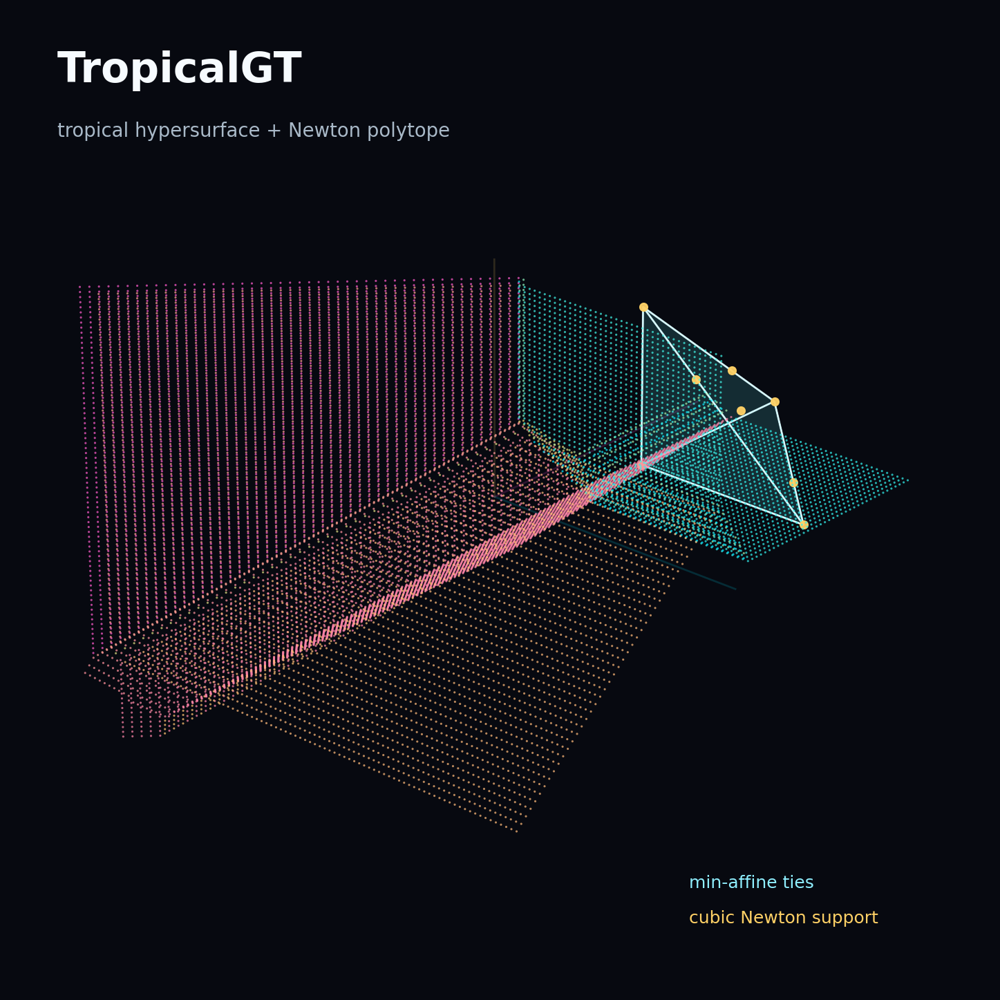

# TropicalGT

TropicalGT develops reasoning agents that use tropical geometry in transformer embedding space: TokenGT-style graph tokenization, tropical ring attention, graph-of-thought trajectories, GFlowNet training, GraphCG latent steering, and auditable reasoning visualizations.

[](https://github.com/amelie-iska/TropicalGT/raw/tropicalgt-i-implementation/references/main.pdf)
[](https://github.com/amelie-iska/TropicalGT/raw/tropicalgt-i-implementation/TropicalGT-I/assets/tropicalgt_neurips_research_paper.pdf)
[](https://github.com/amelie-iska/TropicalGT/raw/tropicalgt-i-implementation/TropicalGT-II/assets/tropicalgt_ii_dynamical_tropical_geometry.pdf)
[](https://github.com/amelie-iska/TropicalGT/raw/tropicalgt-i-implementation/TropicalGT-III/assets/tropicalgt_iii_context_protocols_memory_retrieval.pdf)
[](https://github.com/amelie-iska/TropicalGT/raw/tropicalgt-i-implementation/TropicalGT-IV/assets/tropicalgt_iv_oracle_trajectory_classifiers.pdf)
[](https://huggingface.co/datasets/AmeliSchreiber/TropicalGT)
[](https://huggingface.co/AmeliSchreiber/TropicalGT)
[](https://github.com/amelie-iska/TropicalGT)



## Remote workspace

All implementation work for this repo is under:

```bash
tailscale ssh iska@iska
cd /home/iska/Documents/amelie/bio/TropicalGT
```

Use the `tokengt` environment directly in noninteractive shells:

```bash
/home/iska/miniconda3/envs/tokengt/bin/python --version
```

## Repository layout

- `TropicalGT-I/` is the active v1 implementation.
- `TropicalGT-I/src/tropicalgt/` contains the runnable package.
- `TropicalGT-I/scripts/` contains training, eval, inference, validation, visualization, and readiness-audit CLIs.
- `TropicalGT-I/configs/smoke.json` is a CPU fixture smoke config.
- `TropicalGT-I/configs/gpu_smoke.json` is the RTX 4090 data-backed smoke config.
- `TropicalGT-I/configs/train.json` is the first full data-backed training config.
- `TropicalGT-I/assets/tropicalgt_neurips_research_paper.tex` is the paper source.
- `planning/` contains reference synthesis and implementation notes.
- `external/` contains separate fork checkouts and is intentionally gitignored by this repo.

## Data

The ToricGT dataset has been moved, not copied, into:

```bash
TropicalGT-I/data/toricgt
```

The default training shard root is:

```bash
TropicalGT-I/data/toricgt/curated_hf_shards
```

Data is gitignored. Do not commit datasets, checkpoints, W&B runs, or `keys.txt`.

Data-backed configs set `require_data: true`, so missing or unreadable parquet shards fail loudly instead of silently training on fixture examples. The parquet loader builds a row-group metadata index over train/validation/test shards and reads records through a bounded row-group cache controlled by `cache_shards`; it does not concatenate the full moved dataset into memory. The full `train.json` config enables `chunk_shuffle`, which randomizes parquet row-group order while preserving row-group-local reads. Use `shuffle_rows_within_chunk` for small smoke/debug runs, but avoid PyTorch `shuffle: true` on full parquet unless deliberate random-access cache pressure is acceptable.

Generate a shard manifest and tokenization preflight report before a long run:

```bash
PYTHONPATH=TropicalGT-I/src \
/home/iska/miniconda3/envs/tokengt/bin/python \
TropicalGT-I/scripts/validate_tropicalgt_i.py \
--config TropicalGT-I/configs/train.json \
--split train \
--limit 64 \
--output TropicalGT-I/outputs/train/validate_train.json
```

## Install/runtime notes

The `tokengt` env already provides PyTorch, pandas, pyarrow, datasets, tqdm, sklearn, transformers, W&B, Gudhi, Ripser, Persim, NetworkX, SciPy, SymPy, and Plotly. The optional `multipers` package can be installed later for richer multiparameter signed-measure backends; until then TropicalGT-I uses its in-repo bounded exact multiparameter persistence and commutative-algebra fallback.

## Run tests

```bash
cd /home/iska/Documents/amelie/bio/TropicalGT
/home/iska/miniconda3/envs/tokengt/bin/python -m pytest TropicalGT-I/tests -q
```

## CPU smoke

```bash
PYTHONPATH=TropicalGT-I/src \
/home/iska/miniconda3/envs/tokengt/bin/python \
TropicalGT-I/scripts/train_tropicalgt_i.py \
--config TropicalGT-I/configs/smoke.json
```

This writes:

- `TropicalGT-I/checkpoints/tropicalgt_i_cpu_smoke.pt`
- `TropicalGT-I/checkpoints/tropicalgt_i_cpu_smoke.latest.pt`
- `TropicalGT-I/outputs/smoke/train_report.json`
- `TropicalGT-I/outputs/smoke/reasoning_trajectory_3d.html`
- `TropicalGT-I/outputs/smoke/reasoning_trajectory_pca_nll.html`
- `TropicalGT-I/outputs/smoke/reasoning_trajectory_payloads.json`
- `TropicalGT-I/outputs/smoke/training_metrics.html`

## GPU smoke with W&B

```bash
PYTHONPATH=TropicalGT-I/src \
/home/iska/miniconda3/envs/tokengt/bin/python \
TropicalGT-I/scripts/train_tropicalgt_i.py \
--config TropicalGT-I/configs/gpu_smoke.json
```

The script reads the W&B API key from `keys.txt` when W&B is enabled. It logs NLL, exact text BPB, graph-BPB, graph side-information BPB, optimistic graph-conditioned BPB, GFlowNet trajectory-balance loss, GraphCG losses and direction geometry, finite graph-certificate loss/agreement, tropical support entropy, tropical margins, margin-threshold wall-hit rate, graph token counts, graph structural byte counts, explicit graph JSON byte counts, graph JSON fallback/sequentialization rates, algebraic persistence summaries, analogical-memory query norms, examples/sec, tokens/sec, GPU memory, and generated HTML artifacts.

The primary Parameter-Golf-style metric is text BPB:

```text
bpb = NLL_bits / predicted_target_bytes
```

For TokenGT-style graph conditioning the reports also include:

```text
graph_bpb = (NLL_bits + 8 * graph_bpb_side_weight * explicit_graph_json_bytes)
            / (predicted_target_bytes + graph_token_structural_bytes)
graph_sideinfo_bpb = (NLL_bits + side_info_bits) / predicted_target_bytes
graph_conditioned_bpb_no_side_cost = NLL_bits / (predicted_target_bytes + graph_token_structural_bytes)
```

Sequential text path graphs are deterministic from the byte stream and are excluded from explicit side-information byte accounting. All auxiliary metrics should be ablated by whether they improve held-out `bpb` and `graph_bpb`; a prettier trajectory or cleaner algebraic invariant is not a win by itself.

The certificate metrics are finite graph-structure checks: edge tokens are rewarded when their active tropical support lies on the edge itself or one of its endpoint vertex tokens. These certificates are useful for auditing whether tropical supports follow the TokenGT graph skeleton, but they are not semantic correctness proofs and must be interpreted beside task loss, verifier scores, and held-out BPB.

The reasoning payload JSON stores the hover text, PCA/NLL point coordinates, and the full finite filtered simplicial object for each visualized record. In v1 these objects include 0-simplices for graph vertices, 1-simplices for graph edges, directed length-2 path 2-simplices, filtration thresholds, and per-record summaries.

Training checkpoints contain model state, optimizer state, current step, metrics, history, config, and RNG state. Resume a run by pointing `train_tropicalgt_i.py` at a final or `.latest.pt` checkpoint:

```bash
PYTHONPATH=TropicalGT-I/src /home/iska/miniconda3/envs/tokengt/bin/python TropicalGT-I/scripts/train_tropicalgt_i.py --config TropicalGT-I/configs/gpu_smoke.json --resume-from TropicalGT-I/checkpoints/tropicalgt_i_gpu_smoke.latest.pt --max-steps 8
```

## Data-backed training launch

After the preflight report is clean, launch the first full TropicalGT-I run with:

```bash
PYTHONPATH=TropicalGT-I/src \
/home/iska/miniconda3/envs/tokengt/bin/python \
TropicalGT-I/scripts/train_tropicalgt_i.py \
--config TropicalGT-I/configs/train.json
```

Resume it with:

```bash
PYTHONPATH=TropicalGT-I/src \
/home/iska/miniconda3/envs/tokengt/bin/python \
TropicalGT-I/scripts/train_tropicalgt_i.py \
--config TropicalGT-I/configs/train.json \
--resume-from TropicalGT-I/checkpoints/tropicalgt_i_train.latest.pt
```

The training report includes a parquet manifest for the train and validation splits in addition to losses, graph-token counts, certificate metrics, throughput metrics, W&B metadata, visualization paths, and checkpoint paths.

## Eval, inference, validation, visualization

```bash
PYTHONPATH=TropicalGT-I/src /home/iska/miniconda3/envs/tokengt/bin/python TropicalGT-I/scripts/validate_tropicalgt_i.py --config TropicalGT-I/configs/smoke.json
PYTHONPATH=TropicalGT-I/src /home/iska/miniconda3/envs/tokengt/bin/python TropicalGT-I/scripts/eval_tropicalgt_i.py --config TropicalGT-I/configs/smoke.json --checkpoint TropicalGT-I/checkpoints/tropicalgt_i_cpu_smoke.pt --details-limit 4
PYTHONPATH=TropicalGT-I/src /home/iska/miniconda3/envs/tokengt/bin/python TropicalGT-I/scripts/infer_tropicalgt_i.py --config TropicalGT-I/configs/smoke.json --checkpoint TropicalGT-I/checkpoints/tropicalgt_i_cpu_smoke.pt --prompt "Question: add 2 and 3 Answer:" --scale-depth 2 --scale-width 3 --scale-branch-factor 2 --output TropicalGT-I/outputs/smoke/inference_audit.json
PYTHONPATH=TropicalGT-I/src /home/iska/miniconda3/envs/tokengt/bin/python TropicalGT-I/scripts/render_reasoning_visualizations.py --config TropicalGT-I/configs/smoke.json --checkpoint TropicalGT-I/checkpoints/tropicalgt_i_cpu_smoke.pt
```

Validation reports graph JSON fallback rates, graph-token count statistics, node/edge statistics, and sample graph-token descriptors. Evaluation reports aggregate NLL/BPB/graph-BPB plus optional per-record NLL, graph-token traces, tropical support histograms, and filtered simplicial objects. Inference emits the generated byte-level argmax text together with BPB accounting, graph-token trace, tropical margins/supports, GFlowNet action probabilities, GraphCG direction diagnostics, and the filtered simplicial object for the prompt graph.

Inference-time scaling is enabled by `inference_scaling` config defaults or explicit CLI flags. The bounded controller expands a prompt graph by GFlowNet-preferred actions (`expand`, `merge`, `refine`, `stop`, `retrieve`, `verify`, `compress`, `reject`), scores candidates with prompt NLL, tropical margin, action probability, and graph-token budget terms, then reports the best graph-of-thought candidate with its action path and filtered object.

For a full algebraic/topological inference audit with analogical memory retrieval:

```bash
PYTHONPATH=TropicalGT-I/src \
/home/iska/miniconda3/envs/tokengt/bin/python \
TropicalGT-I/scripts/infer_tropicalgt_i.py \
--config TropicalGT-I/configs/gpu_smoke.json \
--checkpoint TropicalGT-I/checkpoints/tropicalgt_i_gpu_smoke.pt \
--prompt "Question: prove that a two-step reasoning chain can be represented as a graph. Answer:" \
--scale-depth 2 \
--scale-width 3 \
--scale-branch-factor 2 \
--audit-level full \
--audit-ph-backend gudhi \
--audit-render-html \
--memory-bank TropicalGT-I/outputs/gpu_smoke/analogical_memory/reasoning_memory.jsonl \
--memory-save \
--memory-retrieve-top-k 3 \
--audit-output-dir TropicalGT-I/outputs/gpu_smoke/inference_full_audit \
--output TropicalGT-I/outputs/gpu_smoke/inference_full_audit.json
```

This writes a graph-of-thought PCA trajectory whose nodes are reasoning candidates and whose edges are parent-child expansions. Hover payloads summarize the filtered simplicial complex attached to that reasoning step, while the JSON payload stores the full complex, multiparameter persistence report, commutative-algebra proxies, derived-equivalence signature, GraphCG direction diagnostics, and analogical memory retrieval details.

## BPB ablation analysis

Use the ablation analyzer after smoke runs or matched-seed experiment ladders to screen which auxiliary metrics correlate with the primary compression targets:

```bash
PYTHONPATH=TropicalGT-I/src \
/home/iska/miniconda3/envs/tokengt/bin/python \
TropicalGT-I/scripts/analyze_bpb_ablations.py \
TropicalGT-I/outputs/gpu_smoke/train_report.json \
--output-dir TropicalGT-I/outputs/gpu_smoke/bpb_ablation
```

For multiple matched runs, pass every `train_report.json` and set `--baseline` to the baseline report. The tool writes JSON, Markdown, and Plotly HTML rankings for correlations against `bpb`, `graph_bpb`, `eval_bpb`, and `eval_graph_bpb`. Treat the output as a screen for the next ablation, not as causal evidence; promote an auxiliary only when the matched run improves held-out `bpb` or `graph_bpb`.

To generate a matched ablation grid and optionally train the variants in sequence:

```bash
PYTHONPATH=TropicalGT-I/src \
/home/iska/miniconda3/envs/tokengt/bin/python \
TropicalGT-I/scripts/run_bpb_ablation_grid.py \
--config TropicalGT-I/configs/gpu_smoke.json \
--output-dir TropicalGT-I/outputs/gpu_smoke/bpb_ablation_grid \
--variants baseline,no_graphcg,no_gflownet,no_certificate,no_tropical_regularizers,no_auxiliary \
--max-steps 4 \
--run
```

By default the grid runner disables W&B media/network logging for the variants and keeps a shared seed across all runs. Add `--wandb` only when online logging for every ablation variant is desired. Add `--fixture --device cpu` for a quick local sanity check that writes configs and reports without touching the moved parquet dataset.

Before a long run, write a single readiness proof bundle that checks the environment, packages, data manifest, sample TokenGT conversion, paper artifacts, checkpoint reload, finite eval, bounded inference scaling, and visualization generation:

```bash
PYTHONPATH=TropicalGT-I/src \
/home/iska/miniconda3/envs/tokengt/bin/python \
TropicalGT-I/scripts/audit_tropicalgt_i_readiness.py \
--config TropicalGT-I/configs/gpu_smoke.json \
--checkpoint TropicalGT-I/checkpoints/tropicalgt_i_gpu_smoke.pt \
--split validation \
--sample-limit 16 \
--details-limit 2 \
--scale-depth 1 \
--scale-width 2 \
--scale-branch-factor 2 \
--render-visualizations \
--output TropicalGT-I/outputs/gpu_smoke/readiness_audit.json
```

The command also writes `readiness_audit.md` next to the JSON report and exits nonzero if any required gate fails.

## External forks

- `external/TokenGT`: fork of `jw9730/tokengt` under `amelie-iska/TokenGT`.
- `external/parameter-golf`: OpenAI Parameter Golf fork; branch `tropicalgt-i-tokenization` contains `tropicalgt_tokengt_adapter.py`.
- `external/GraphCG`: GraphCG fork used for methodology reference.
- `external/Tropical-Attention`: Tropical Attention fork used for kernel/reference comparison.

These are separate git repositories and should be pushed separately from TropicalGT.

### Parameter-Golf TokenGT adapter

The Parameter-Golf baseline keeps its default language-model path unchanged. To enable graph conditioning in experiments that pass TokenGT-style graph tensors into `GPT.forward`, set:

```bash
TROPICALGT_GRAPH_ADAPTER=1
TROPICALGT_GRAPH_FEATURE_DIM=48
```

The optional `graph_tokens` argument is a tuple `(token_features, token_type_ids, graph_mask)`. The adapter pools graph node/edge tokens into a model-width context vector and adds it to each text-token embedding before the baseline transformer stack.
