# TropicalGT-I Browser Photo Annotation Review

Generated: 2026-06-12

This file consolidates the browser/photo annotations from the current TropicalGT-I visualization repair session. Screenshots in `photo_annotation_review_assets/` were regenerated from the current local browser artifact root at `http://127.0.0.1:8977/`, except the first screenshot, which was the original local attachment that was still present on disk.

The sample-browser shell and card layout were explicitly marked as acceptable and should be preserved. Most repair work below belongs inside individual artifacts: NLL landscape semantics, directed GoT overlays, radius sliders, simplex-tree inspection, analogical memory diagnostics, and persistence/topology provenance.

## High-Level Keep / Change

Keep:
- The `TropicalGT-I Multi-Run Sample Audit` index layout, sample cards, artifact buttons, and complete artifact catalog entry.
- The sample-first organization and single-page nested artifact catalog.

Change:
- Every selected simplicial object panel should expose an obvious left-to-right radius slider.
- Every simplicial object should show faint dotted directed GoT/token/map edges underneath, with solid persistence/radius edges filled on top by the slider.
- Simplex-tree plots need hover/click detail panes revealing the exact tokens/simplex members and provenance.
- NLL plots must read as a model-evaluated local energy/fitness landscape around embedding vectors, not a sparse hull or decorative surface.
- Analogical memory must explain unavailable cases, retrieve non-self memories when possible, and display map edges/details when a correspondence exists.
- Persistence landscapes, barcode panels, and vector representations must be visibly derived from the actual reasoning-trajectory embedding/probability complexes.

## Annotation Index

| ID | Area | Screenshot | Original / Current Page | Annotation Summary |
| --- | --- | --- | --- | --- |
| A00 | Initial unreadable heatmap | `initial_unreadable_distance_heatmap.png` | original attached screenshot | Candidate/trajectory matrix labels were unreadable and looked copied/contrived. |
| A01 | NLL energy landscape | `got_nll_landscape.png` | `sample_000/got_trajectory_pca_3d.html` | NLL surface does not yet look like an energy or fitness landscape around embedding vectors. |
| A02 | Embedding trajectory map | `embedding_map.png` | `sample_000/got_embedding_map_3d.html` | Graph-of-thought trajectory must be clearly real, directional, and model-derived. |
| A03 | Full radius complex | `full_radius_complex.png` | `sample_000/got_full_trajectory_complex.html` | Full trajectory complex should be interpretable as a real reasoning trajectory complex. |
| A04 | Probability / Jensen-Shannon complex | `probability_complex.png` | `sample_000/got_full_trajectory_complex_jensen_shannon.html` | Probability-vector complex must use actual model probabilities and Jensen-Shannon distance. |
| A05 | Full simplex tree | `full_simplex_tree.png` | `sample_000/got_full_trajectory_simplex_tree_3d.html` | Simplex-tree visualization needs accuracy, interpretability, and token/simplex detail. |
| A06 | Probability simplex tree | `probability_simplex_tree.png` | `sample_000/got_full_trajectory_simplex_tree_3d_jensen_shannon.html` | Same accuracy and interpretability requirements for Jensen-Shannon simplex trees. |
| A07 | Tropical support | `tropical_support.png` | `sample_000/tropical_support_heatmap.html` | Tropical support heatmap/layout was called garbage and must be made compact, readable, and provenance-backed. |
| A08 | GraphCG directions | `graphcg_directions.png` | `sample_000/graphcg_direction_cosines.html` | Labels and top-direction heatmap are jammed and unreadable. |
| A09 | Analogical memory | `analogical_memory.png` | `sample_000/analogical_memory_retrieval.html` | Current bundle shows no non-self analogies; investigate retrieval and explain failures. |
| A10 | Persistence barcode panel | `persistence_barcode.png` | `sample_000/trajectory_persistence/persistence_barcode.html` | Selected complex panel needs radius slider plus dotted directed reasoning edges. |
| A11 | Persistence vector representations | `persistence_representations.png` | `sample_000/trajectory_persistence/persistence_representations.html` | Same selected-complex issue: radius slider and directed overlay are missing or unclear. |
| A12 | Persistence landscapes | `persistence_landscapes.png` | `sample_000/trajectory_persistence/persistence_landscapes.html` | Review accuracy; ensure landscapes are generated from actual embedding-vector reasoning trajectories. |
| A13 | Step-complex catalog | `step_complex_catalog.png` | `sample_000/reasoning_step_complex_maps/complexes_catalog.html` | All step complex pages should live behind this single link. |
| A14 | Step-tree catalog | `step_tree_catalog.png` | `sample_000/reasoning_step_complex_maps/simplex_trees_catalog.html` | All step simplex-tree pages should live behind this single link. |
| A15 | Step 000 complex | `step000_complex.png` | `sample_000/reasoning_step_complex_maps/reasoning_step_000.html` | Needs directionality, dotted arrows, clear token identity, and interpretable actual step vectors. |
| A16 | Step 004 complex | `step004_complex.png` | `sample_000/reasoning_step_complex_maps/reasoning_step_004.html` | Radius slider must be explicit; directed edges should remain faint/dotted while persistence edges fill solid. |
| A17 | Step 000 simplex tree | `step000_simplex_tree.png` | `sample_000/reasoning_step_complex_maps/reasoning_step_000_simplex_tree.html` | Add hover/click feature to reveal tokens in each simplex; review accuracy. |
| A18 | Step 004 simplex tree | `step004_simplex_tree.png` | `sample_000/reasoning_step_complex_maps/reasoning_step_004_simplex_tree.html` | Same simplex-tree token/provenance detail requirement. |
| A19 | Browser index | `browser_index.png` | `browser_index.html` | Overall functionality and layout look as they should; avoid unnecessary layout churn. |
| A20 | Complete catalog | `catalog.png` | `interactive_visualization_catalog.html` | Catalog is the correct direction for single-link review of nested artifacts. |

## Detailed Annotation Register

### A00 - Initial unreadable trajectory/matrix artifact

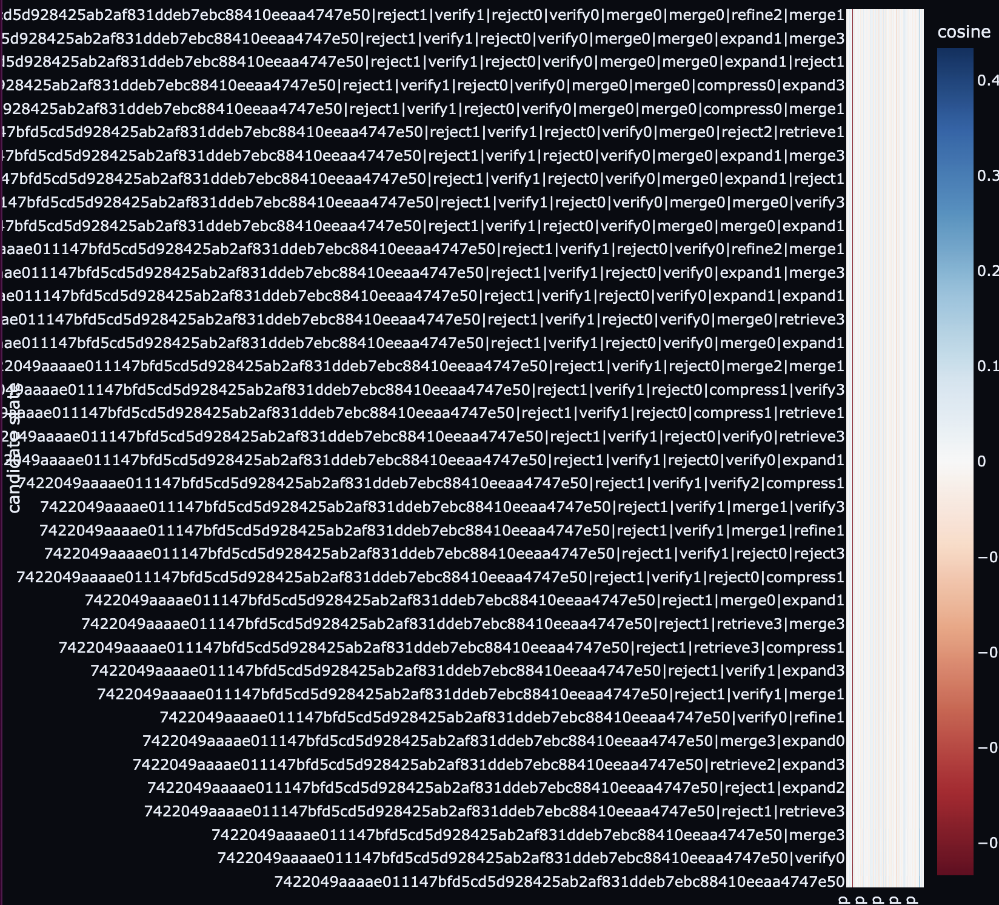

Source: original attached screenshot, local path copied from temporary screenshot storage.

Annotation:
- Labels were unreadable and appeared to be repeated hashes/trajectory strings.
- Analogical reasoning maps looked like exact copies of the same trajectory.
- Persistent homology, Betti/free-resolution, tropical support, and GraphCG outputs were described as fake-looking or synthetic.

Repair requirement:
- Remove copied-looking labels and repeated hash clutter.
- Use concise semantic labels plus hover/click detail for long records.
- Every plot must be provenance-backed by model embeddings, model probabilities, and real graph-of-thought records.

### A01 - NLL / energy landscape

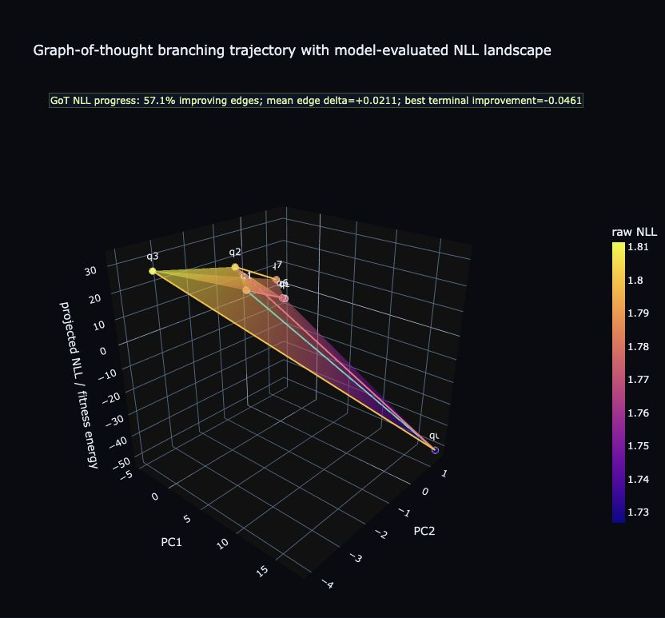

Pages:
- Current: `http://127.0.0.1:8977/sample_000/got_trajectory_pca_3d.html`
- Earlier annotated page: `sample_002/got_trajectory_pca_3d.html`

Annotations:
- "Doesn't look like a NLL energy or fitness landscape for the embedding vectors or reasoning trajectory clusters of embedding vectors."
- Later: "Still does not look like an energy or fitness landscape around the embedding vectors."
- Every trajectory point should touch the NLL energy surface.

Repair requirement:
- Surface must be a local model-evaluated field around embedding-neighborhood coordinates.
- Points must lie exactly on the plotted NLL surface height.
- If the model cannot evaluate local perturbation/grid points, render an explicit unavailable diagnostic instead of a hull pretending to be an energy surface.
- Plot should distinguish model-evaluated anchors, local interpolation if used, and actual GoT trajectory edges.

### A02 - Embedding map trajectory

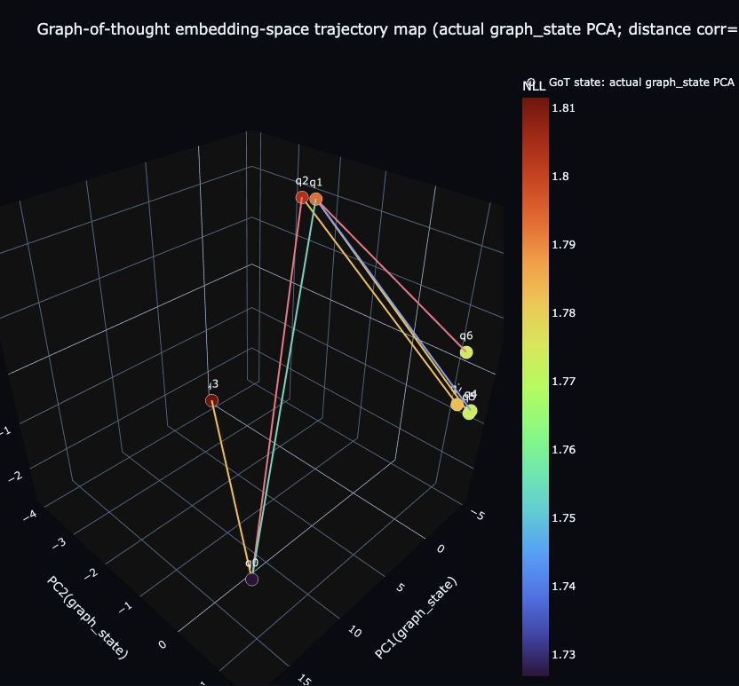

Pages:
- Current: `http://127.0.0.1:8977/sample_000/got_embedding_map_3d.html`
- Earlier annotated page: `sample_002/got_embedding_map_3d.html`

Annotations:
- "Complete bullshit, not a real reasoning trajectory."
- Should use real embedding vectors from the model and graph-of-thought reasoning trajectories.

Repair requirement:
- Show the actual model graph-state PCA trajectory.
- Preserve parent-child transitions, branch/depth identity, and step provenance.
- Fail closed if embeddings or complete GoT records are missing.

### A03 - Full radius complex

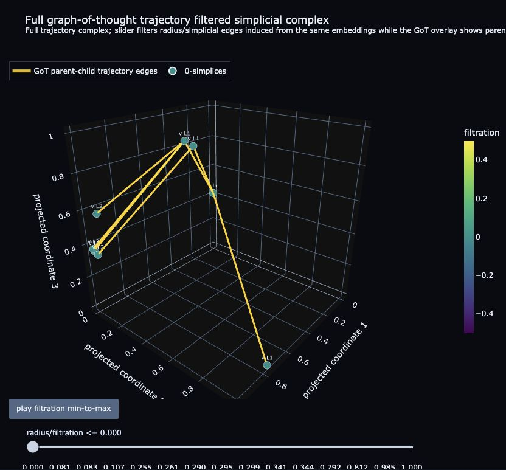

Pages:
- Current: `http://127.0.0.1:8977/sample_000/got_full_trajectory_complex.html`
- Earlier annotated page: `sample_002/got_full_trajectory_complex.html`

Annotations:
- "Looks wrong, doesn't look like a real reasoning trajectory."
- Radius topology is built from the trajectory embedding vectors; it should not be treated as separate from trajectory embedding.

Repair requirement:
- Use actual candidate/state embedding vectors as vertices.
- Overlay faint directed GoT trajectory edges and solid radius/persistence edges.
- Radius slider should move left-to-right from sparse to dense.
- Summary should show displayed/source counts and any truncation.

### A04 - Probability / Jensen-Shannon complex

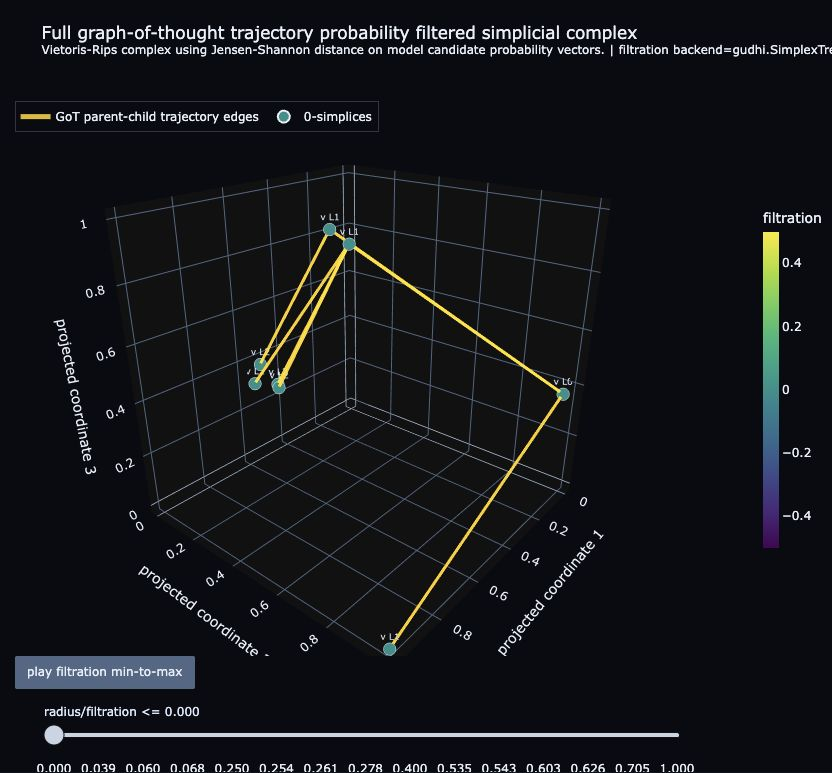

Page: `http://127.0.0.1:8977/sample_000/got_full_trajectory_complex_jensen_shannon.html`

Annotations:
- Need a probability-distribution version using probabilities from the model that the embedding vectors map to.
- Use Jensen-Shannon distance.
- No proxies, no fake or synthetic fallbacks.

Repair requirement:
- Vertices must carry actual model probability vectors.
- Filtration distances must be Jensen-Shannon distances.
- Missing probabilities should produce explicit unavailable diagnostics.

### A05 - Full simplex tree

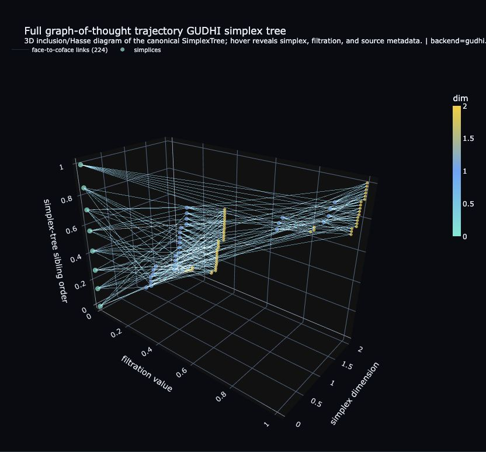

Pages:
- Current: `http://127.0.0.1:8977/sample_000/got_full_trajectory_simplex_tree_3d.html`
- Earlier annotated page: `sample_002/got_full_trajectory_simplex_tree_3d.html`

Annotations:
- "Looks like bullshit and crappy."
- Ensure accuracy and correctness of all simplex-tree plots.

Repair requirement:
- Plot actual GUDHI simplex-tree inclusion/provenance.
- Add hover/click details for simplex vertices/tokens, filtration, dimension, faces/cofaces, and source object.
- Avoid unreadable sprayed Hasse diagrams; use filtering, selection, and detail panels.

### A06 - Probability simplex tree

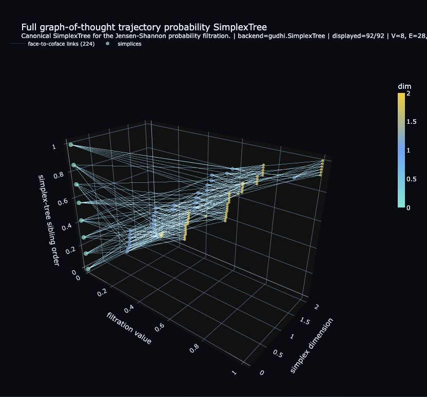

Pages:
- Current: `http://127.0.0.1:8977/sample_000/got_full_trajectory_simplex_tree_3d_jensen_shannon.html`
- Earlier annotated page: `sample_002/got_full_trajectory_simplex_tree_3d_jensen_shannon.html`

Annotations:
- "Looks like bullshit."

Repair requirement:
- Same as A05, but sourced from the Jensen-Shannon probability filtration.
- Detail panel must make probability-vector source and JS filtration explicit.

### A07 - Tropical support

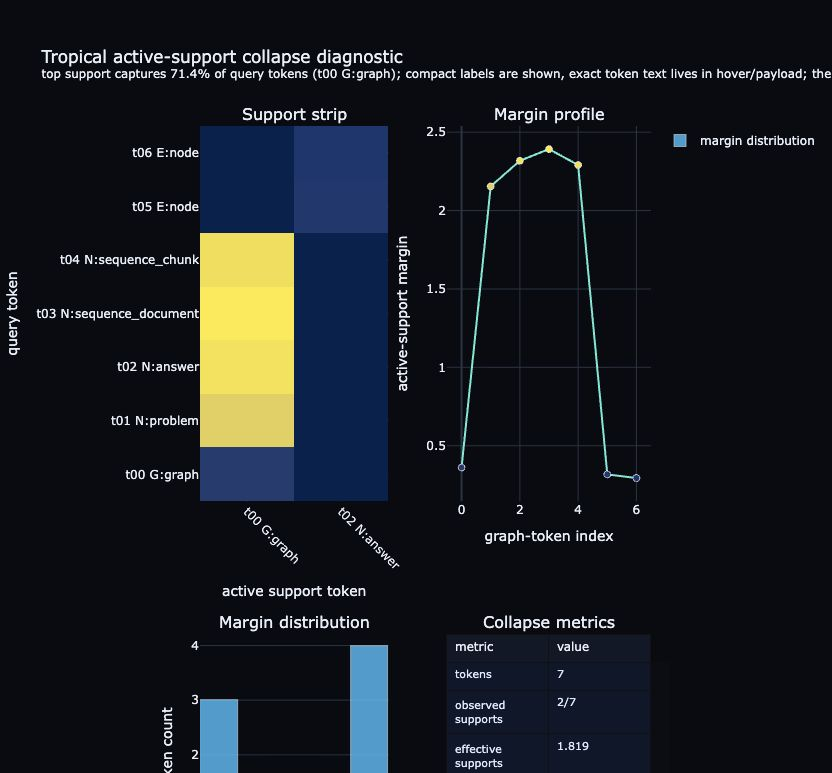

Pages:
- Current: `http://127.0.0.1:8977/sample_000/tropical_support_heatmap.html`
- Earlier annotated page: `sample_002/tropical_support_heatmap.html`

Annotations:
- "Looks like complete garbage and bullshit."

Repair requirement:
- Replace giant block heatmaps and rotated unreadable labels with compact support summaries.
- Show active support distribution, support collapse, margin profile, token provenance, and model source.
- Long token labels must be accessible through hover/click, not jammed into axes.

### A08 - GraphCG directions

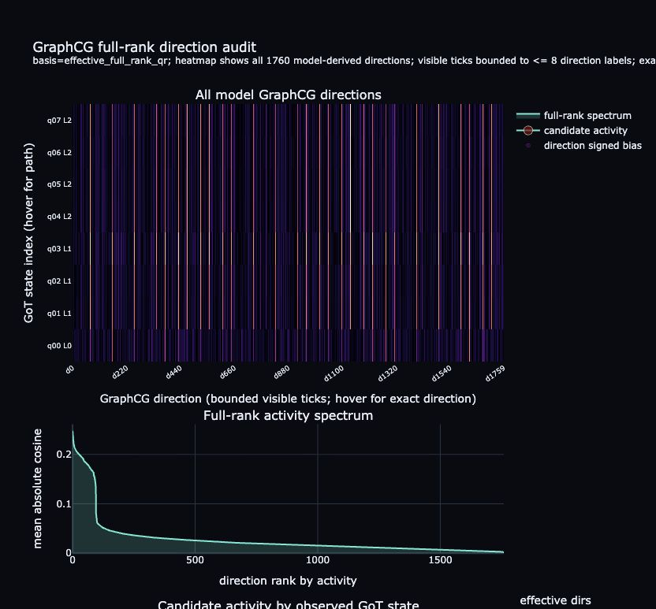

Pages:
- Current: `http://127.0.0.1:8977/sample_000/graphcg_direction_cosines.html`
- Earlier annotated page: `sample_002/graphcg_direction_cosines.html`

Annotations:
- "Some of it is jammed and unreadable."
- Earlier broader comment: GraphCG stuff looked poor.

Repair requirement:
- Reduce axis label density, add readable top-k direction labels, and separate overview from detail.
- Preserve full-rank audit data in hover/detail tables instead of forcing all labels into the visible heatmap.

### A09 - Analogical memory

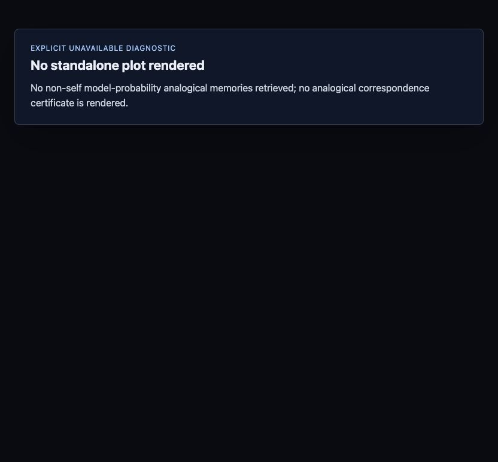

Pages:
- Current: `http://127.0.0.1:8977/sample_000/analogical_memory_retrieval.html`
- Earlier annotated pages: `sample_002/analogical_memory_retrieval.html`, `sample_002/analogical_memory_map_02.html`

Annotations:
- "Doesn't look like a real actual reasoning trajectory."
- "Looks like a bullshit analogical reasoning memory map."
- Current diagnostic: "What went wrong, no analogies? look into it."
- Maintain map edges and show details of simplicial maps.

Repair requirement:
- Investigate why no non-self model-probability analogical memories were retrieved.
- If there are no valid analogies, show retrieval counts, filters, reasons, and candidate failures.
- If correspondences exist, maintain map edges and show domain/codomain simplex-map details, assignment costs, JS distances, preserved/lost simplices, and certificate status.

### A10 - Persistence barcode selected complex

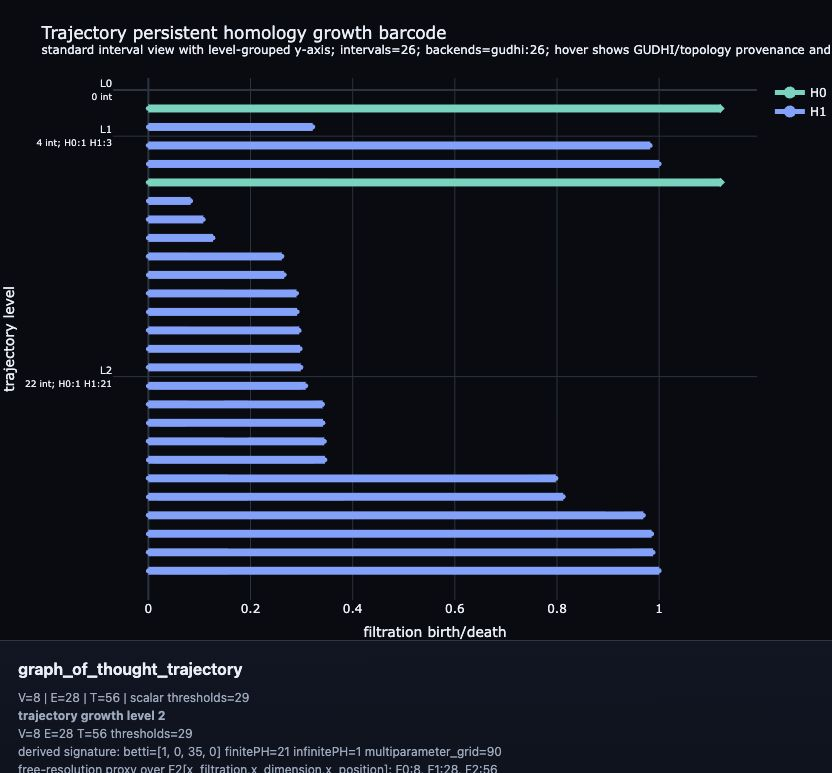

Pages:
- Current: `http://127.0.0.1:8977/sample_000/trajectory_persistence/persistence_barcode.html`
- Earlier annotated page: `sample_002/trajectory_persistence/persistence_barcode.html`

Annotations:
- "All of the plots like this should be interactive 3D filtered simplicial objects with a radius slider (LtR small to large)."
- Later: "Needs a radius slider, and also needs dotted directed edges for direction of reasoning trajectory step token generation, with slider filling in solid edges."

Repair requirement:
- Selected complex panel needs an explicit radius slider.
- Add faint dotted directed GoT/token edges beneath persistence edges.
- Slider should add solid radius/persistence edges/faces.

### A11 - Persistence vector representations selected complex

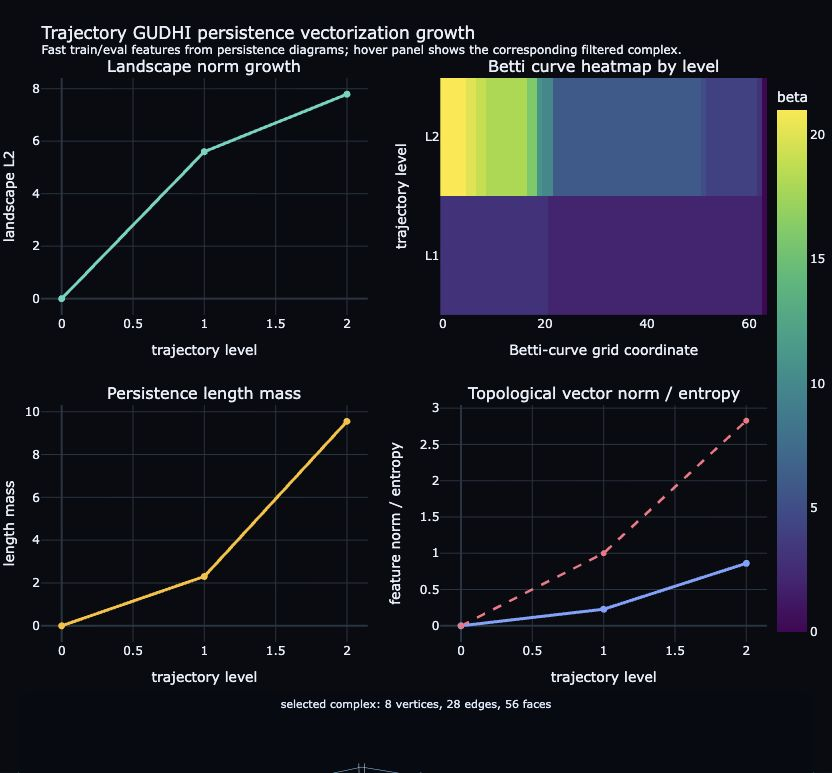

Page: `http://127.0.0.1:8977/sample_000/trajectory_persistence/persistence_representations.html`

Annotation:
- "Same issue as previous."

Repair requirement:
- Apply A10 selected-complex behavior across all persistence pages: radius slider, directed overlay, visible counts, and provenance.

### A12 - Persistence landscapes

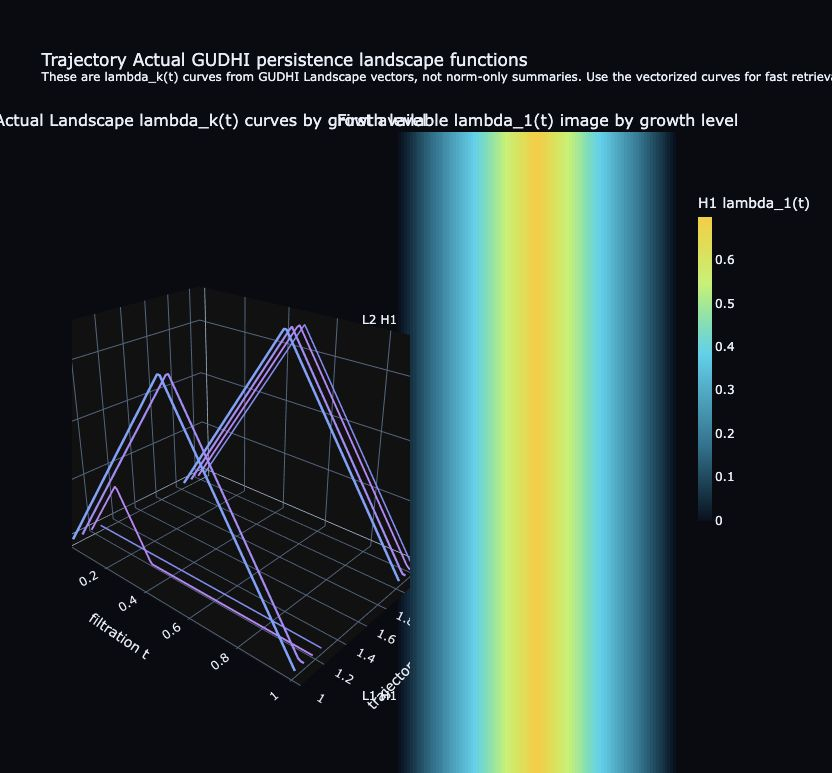

Pages:
- Current: `http://127.0.0.1:8977/sample_000/trajectory_persistence/persistence_landscapes.html`
- Earlier annotated page: `sample_000/trajectory_persistence/persistence_landscapes.html`

Annotations:
- "Persistence landscapes look like bullshit."
- "Review for accuracy and ensure actual plots from embedding vectors in reasoning trajectories are being utilized to generate."

Repair requirement:
- Landscapes must be computed from actual persistence diagrams generated by the reasoning trajectory embedding/probability complexes.
- If persim/GUDHI landscape computation is not available, emit explicit unavailable diagnostics.
- Avoid synthetic-looking image heatmaps without clear diagram/interval provenance.

### A13 - All reasoning step complexes catalog

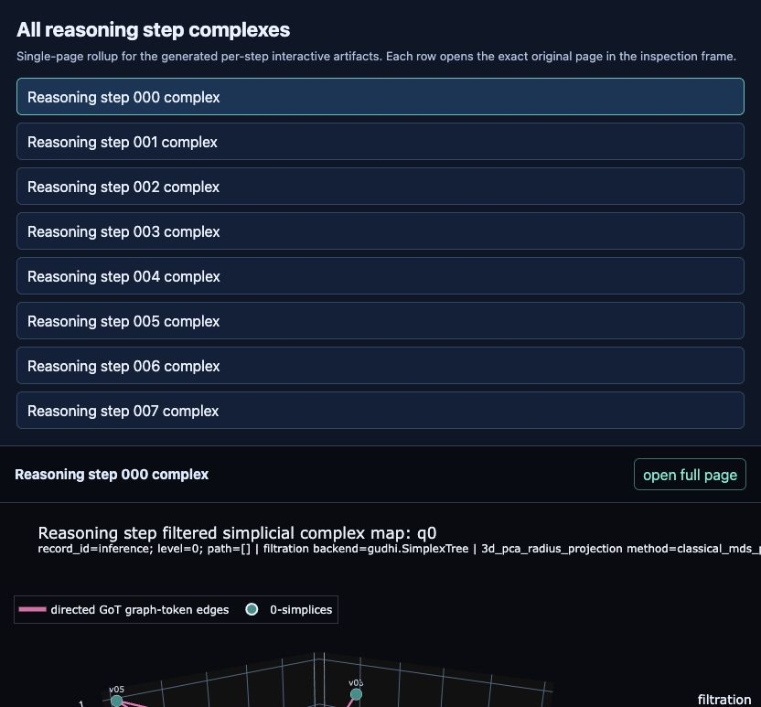

Pages:
- Current: `http://127.0.0.1:8977/sample_000/reasoning_step_complex_maps/complexes_catalog.html`
- Browser index source button: "All reasoning step complexes."

Annotation:
- Individual reasoning step complex pages should be on a single page with a single link.

Repair requirement:
- Preserve this catalog link.
- Catalog should list every step complex with status, counts, model source, and direct links.

### A14 - All reasoning step simplex trees catalog

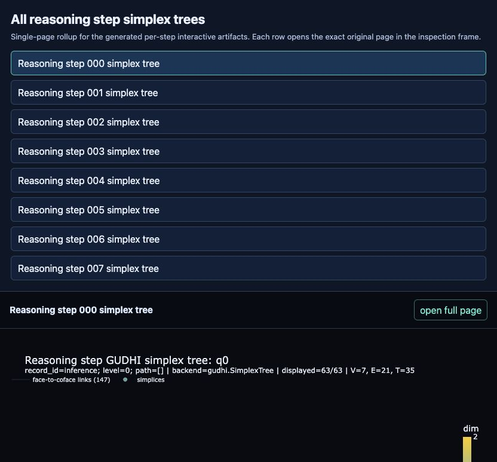

Pages:
- Current: `http://127.0.0.1:8977/sample_000/reasoning_step_complex_maps/simplex_trees_catalog.html`
- Browser index source button: "All reasoning step simplex trees."

Annotation:
- Same catalog requirement for simplex-tree pages.

Repair requirement:
- Preserve this single-link tree catalog.
- Catalog should make step coverage and missing/unavailable items explicit.

### A15 - Reasoning step 000 complex

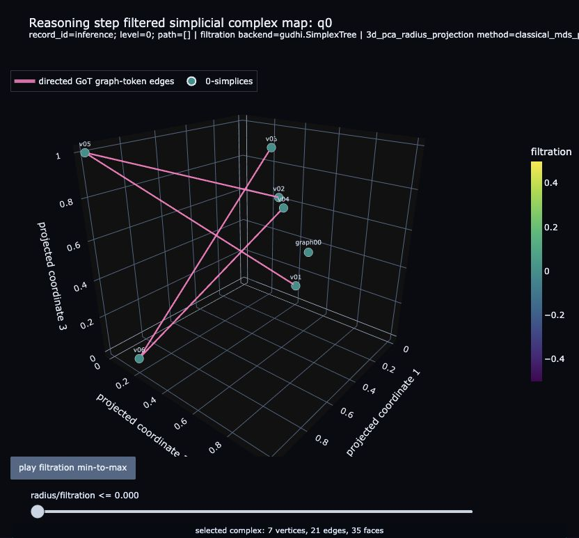

Pages:
- Current: `http://127.0.0.1:8977/sample_000/reasoning_step_complex_maps/reasoning_step_000.html`
- Earlier annotated page: `sample_002/reasoning_step_complex_maps/reasoning_step_000.html`

Annotations:
- Each reasoning step should be a collection of embedding vectors or probability vectors obtained from them.
- It should have directionality corresponding to graph-of-thought reasoning.
- Later: "Doesn't make sense, not interpretable, also no directionality or dotted arrows, and no clear indication of what the tokens are."

Repair requirement:
- Each step must be a complete reasoning step, not a thin proxy state.
- Show token identities, token roles, directionality, and model source.
- Add faint dotted directed edges/arrows under radius topology.

### A16 - Reasoning step 004 complex

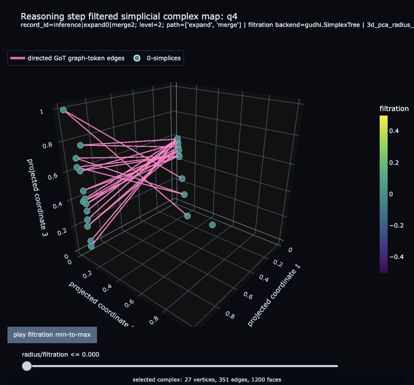

Page: `http://127.0.0.1:8977/sample_000/reasoning_step_complex_maps/reasoning_step_004.html`

Annotations:
- "No radius slider."
- "Could you add in faint dotted edges with arrows to any simplicial object to show directionality, and then have the radius slider fill in solid edges on top for persistence."
- Maintain map edges also, and show details of the simplicial maps.

Repair requirement:
- The selected plot needs a prominent radius slider bound directly to the selected complex.
- Dotted directed edges/arrows should always be visible as reasoning direction context.
- Solid edges/faces should appear as the radius threshold increases.
- Simplicial map edges and map details should not be hidden or overwritten by radius topology.

### A17 - Reasoning step 000 simplex tree

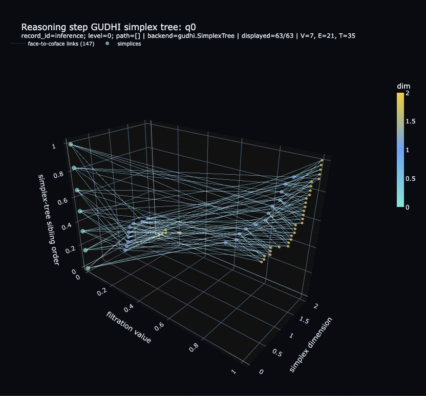

Pages:
- Current: `http://127.0.0.1:8977/sample_000/reasoning_step_complex_maps/reasoning_step_000_simplex_tree.html`
- Earlier annotated page: `sample_002/reasoning_step_complex_maps/reasoning_step_000_simplex_tree.html`

Annotations:
- Ensure accuracy and correctness of all simplex-tree plots.
- Add hover-click feature to reveal the tokens contained in each simplex in the simplex tree.
- Review for interpretability.

Repair requirement:
- Hover/click must reveal simplex members, decoded tokens/text, vertex role, filtration, dimension, faces/cofaces, and provenance object id.
- Plot should avoid visual clutter by using detail panels and filters.

### A18 - Reasoning step 004 simplex tree

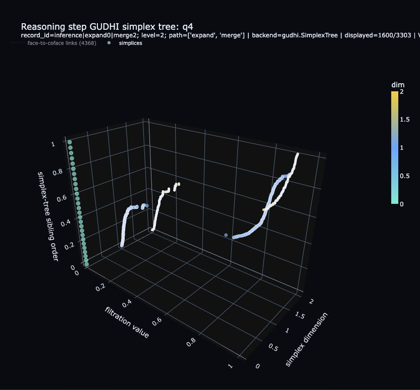

Page: `http://127.0.0.1:8977/sample_000/reasoning_step_complex_maps/reasoning_step_004_simplex_tree.html`

Annotation:
- Same simplex-tree token/provenance detail requirement as A17.

Repair requirement:
- Apply the same hover/click detail and interpretability improvements to all step simplex trees.

### A19 - Browser index layout

Page: `http://127.0.0.1:8977/browser_index.html`

Annotations:
- "Looks as it should, don't change much if anything for this part."
- "Overall functionality and layout of the visualizations looks as it should though."

Repair requirement:
- Preserve the shell, sample card layout, button grid, and catalog entry.
- Keep changes scoped to artifact internals and content quality.

### A20 - Complete artifact catalog

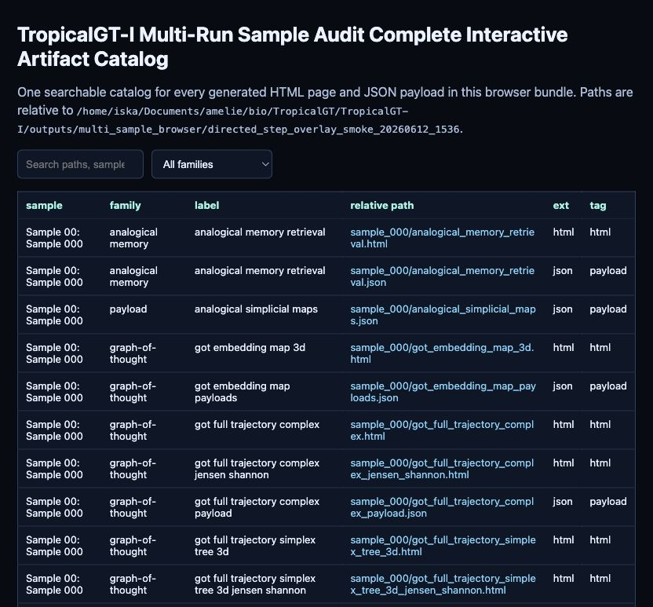

Page: `http://127.0.0.1:8977/interactive_visualization_catalog.html`

Annotation:
- Numerous nested sample artifacts should be listed on a single page linked by a single link.

Repair requirement:
- Preserve this page and keep it complete.
- Add status labels for unavailable diagnostics, generated pages, JSON payloads, and screenshot QA references.

## Consolidated Implementation Checklist

- [ ] Preserve the current sample-browser index and catalog layout.
- [ ] Add explicit LTR radius sliders to every selected simplicial object panel.
- [ ] Add faint dotted directed reasoning/token/map edges under every simplicial object where directionality exists.
- [ ] Ensure radius sliders fill solid persistence edges/faces on top of the directed overlay.
- [ ] Add hover/click simplex detail panes for simplex trees.
- [ ] Add token identity and provenance fields to step complex and simplex-tree hovers.
- [ ] Repair NLL surface so all points touch a model-evaluated/local embedding energy landscape.
- [ ] Ensure persistence landscapes are computed from actual embedding/probability trajectory diagrams or fail closed.
- [ ] Investigate missing analogical memories and display retrieval diagnostics or valid map certificates.
- [ ] Maintain simplicial map edges and detail tables in analogical views.
- [ ] Repair GraphCG label density and tropical support readability.
- [ ] Keep all fake/proxy/fallback behavior out of production paths; explicit unavailable diagnostics are acceptable when real source data are missing.
